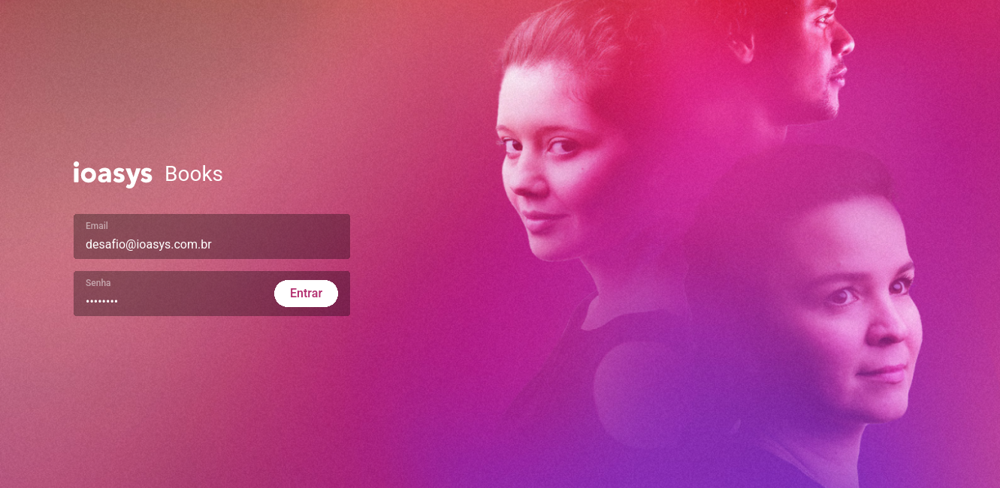
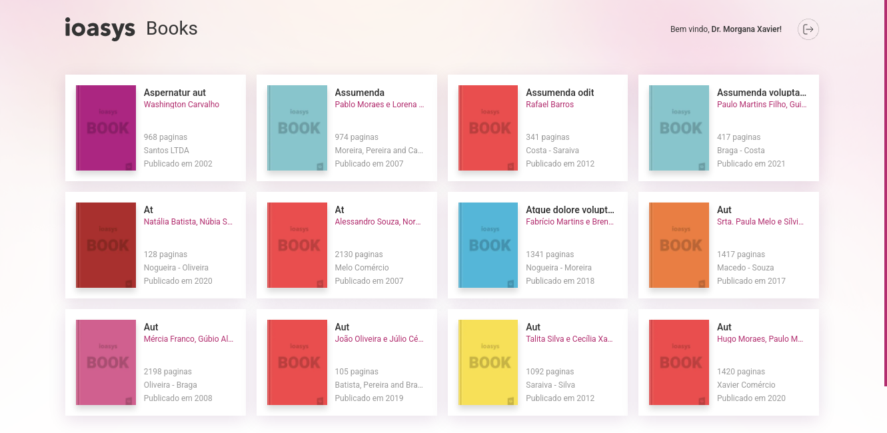
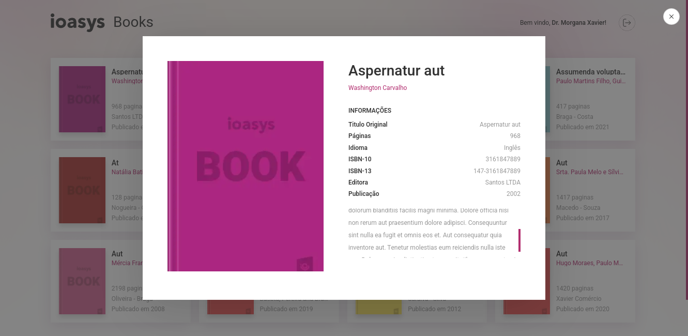

<div align="center">
  <h1>Ioa Books</h1>
  <p>
    an application to list the books
  </p>
</div>

<div align="center">
  
  
  
</div>

## Credentials to login
- User: desafio@ioasys.com.br
- Password: 12341234

## Development
```bash
yarn dev
```

## Production
```bash
yarn build && yarn start
```